# Ansible Dev Spaces 완전 가이드

## 목차

1. [소개](#소개)
2. [사전 준비 작업](#사전-준비-작업)
3. [Red Hat OpenShift Dev Spaces 환경 설정](#red-hat-openshift-dev-spaces-환경-설정)
4. [Dev Spaces IDE 환경 익히기](#dev-spaces-ide-환경-익히기)
5. [Ansible 플레이북 작성 및 실행](#ansible-플레이북-작성-및-실행)
6. [문제 해결 및 디버깅](#문제-해결-및-디버깅)
7. [Git 작업 및 버전 관리](#git-작업-및-버전-관리)
8. [추가 학습 자료](#추가-학습-자료)

---

## 소개

### 프로젝트 개요

이 가이드는 **Red Hat OpenShift Dev Spaces**를 사용하여 Ansible 개발 환경을 설정하고 플레이북을 작성 및 실행하는 전체 과정을 단계별로 설명합니다. 

Ansible은 IT 인프라를 자동화하는 강력한 도구이며, OpenShift Dev Spaces는 클라우드 기반 통합 개발 환경(IDE)입니다. 두 기술을 결합하면 어디서든 일관된 개발 환경에서 Ansible 자동화 작업을 수행할 수 있습니다.

### 학습 목표

이 가이드를 완료하면 다음을 수행할 수 있습니다:

- Red Hat Developer Sandbox에 가입하고 OpenShift Dev Spaces에 접속하기
- Dev Spaces 워크스페이스를 생성하고 관리하기
- Ansible 플레이북을 작성하고 실행하기
- Python 인터프리터 설정 및 일반적인 문제 해결하기
- Git을 사용하여 변경사항을 커밋하고 관리하기
- 시스템 정보를 수집하고 활용하기

### 사전 요구사항

- **GitHub 계정**: 리포지토리를 포크하고 관리하기 위해 필요합니다
- **Red Hat 계정**: Red Hat Developer Sandbox에 접속하기 위해 필요합니다
  - 가입: [https://sandbox.redhat.com](https://sandbox.redhat.com)
- **Windows 환경 (선택사항)**: 로컬 개발 환경을 설정하려는 경우 WSL(Windows Subsystem for Linux) 설치가 필요합니다
- **기본 IT 지식**: Linux 명령어와 Git에 대한 기본 이해가 있으면 도움이 됩니다

### 이 가이드의 구성

이 가이드는 다음 순서로 진행됩니다:

1. **사전 준비 작업**: GitHub 리포지토리 포크 및 로컬 개발 환경 설정 (선택사항)
2. **Dev Spaces 환경 설정**: Developer Sandbox 접속 및 워크스페이스 생성
3. **IDE 환경 익히기**: Dev Spaces의 인터페이스와 프로젝트 구조 이해
4. **플레이북 작성 및 실행**: 첫 번째 Ansible 플레이북 작성 및 실행
5. **문제 해결**: 일반적인 오류와 해결 방법
6. **Git 작업**: 변경사항 커밋 및 버전 관리
7. **다음 단계**: 추가 학습 자료 및 추천 사항

각 섹션은 단계별로 상세히 설명되어 있으며, 화면 캡처 설명과 함께 실제 작업 과정을 따라할 수 있습니다.

---

## 사전 준비 작업

이 섹션에서는 Ansible 개발을 시작하기 전에 필요한 사전 준비 작업을 수행합니다. 로컬에서 개발 환경을 설정하려는 경우에만 이 섹션의 내용이 필요합니다. OpenShift Dev Spaces만 사용할 계획이라면 이 섹션을 건너뛰고 다음 섹션으로 이동할 수 있습니다.

### 2.1 GitHub 리포지토리 포크

GitHub에서 원본 리포지토리를 포크하여 자신의 계정으로 복사합니다. 이렇게 하면 원본 저장소에 영향을 주지 않고 자유롭게 수정하고 실험할 수 있습니다.

#### 단계 1: 원본 리포지토리 찾기

1. 웹 브라우저에서 GitHub에 로그인합니다
2. 다음 원본 리포지토리로 이동합니다:
   - `https://github.com/redhat-developer-demos/ansible-devspaces-demo`

#### 단계 2: 리포지토리 포크

1. 리포지토리 페이지 오른쪽 상단의 **"Fork"** 버튼을 클릭합니다
2. 포크 옵션을 선택합니다 (기본값으로 유지 가능)
3. **"Create fork"** 버튼을 클릭합니다

#### 단계 3: 포크 완료 확인

포크가 완료되면 다음과 같은 알림이 표시됩니다:

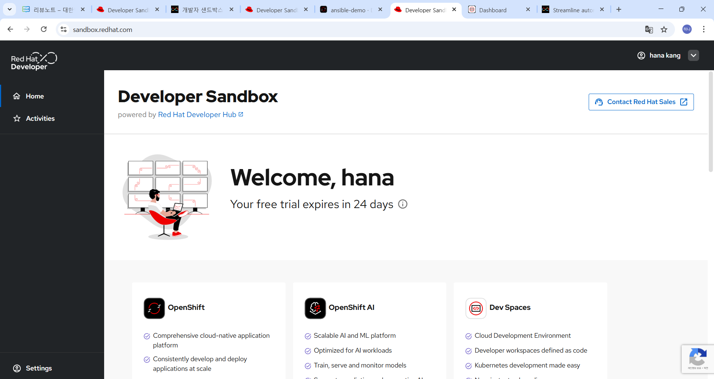

> **알림 메시지:**
> - "The fork 'your-username/ansible-devspaces-demo' was successfully created on GitHub."
> - "Source: GitHub"

이 알림에는 두 가지 옵션이 제공됩니다:
- **"Open on GitHub"**: 새로 포크된 리포지토리를 GitHub에서 엽니다
- **"Create PR"**: Pull Request를 생성할 수 있는 옵션입니다

#### 단계 4: Git 설정

첫 번째 커밋을 하기 전에 Git 사용자 정보를 설정해야 합니다. 터미널에서 다음 명령어를 실행합니다:

```bash
git config --global user.name "Your Name"
git config --global user.email "your.email@example.com"
```

> **참고:** 이 설정은 전역적으로 적용되며, 이후 모든 Git 저장소에서 사용됩니다.

#### 단계 5: Git Fetch 설정

VS Code나 Dev Spaces에서 작업할 때 Git이 주기적으로 원격 저장소의 변경사항을 가져올지 묻는 알림이 나타날 수 있습니다:

> **알림:**
> "Would you like Red Hat OpenShift Dev Spaces with Microsoft Visual Studio Code - Open Source IDE to periodically run 'git fetch'?"

선택 옵션:
- **"Yes"**: 주기적으로 자동으로 `git fetch`를 실행합니다 (권장)
- **"No"**: 자동 `git fetch`를 비활성화합니다
- **"Ask Me Later"**: 나중에 다시 묻습니다

> **팁:** "Yes"를 선택하면 원격 저장소의 최신 변경사항을 자동으로 확인할 수 있어 협업에 유리합니다.

---

### 2.2 로컬 개발 환경 설정 (Windows + WSL)

Windows 환경에서 로컬 개발 환경을 설정하려면 WSL(Windows Subsystem for Linux)을 설치하고 Ubuntu를 설정해야 합니다.

> **중요:** 이 섹션은 Windows 사용자를 위한 선택사항입니다. OpenShift Dev Spaces만 사용할 계획이라면 이 섹션을 건너뛸 수 있습니다.

#### 단계 1: WSL 설치

1. **PowerShell을 관리자 권한으로 실행합니다**
   - Windows 검색에서 "PowerShell"을 검색합니다
   - "Windows PowerShell"을 마우스 오른쪽 버튼으로 클릭합니다
   - **"관리자 권한으로 실행"**을 선택합니다

2. **WSL 설치 명령어 실행**

   PowerShell 창에서 다음 명령어를 입력합니다:

   ```powershell
   wsl --install
   ```

   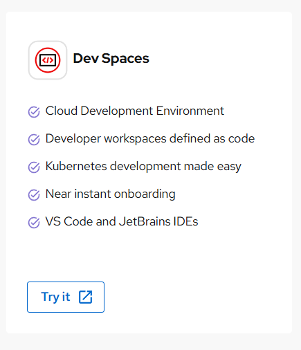

3. **설치 과정 확인**

   설치가 진행되면 다음과 같은 메시지들이 표시됩니다:

   ```
   다운로드 중: Linux용 Windows 하위 시스템 2.6.1
   설치 중: Linux용 Windows 하위 시스템 2.6.1
   Linux용 Windows 하위 시스템 2.6.10이(가) 설치되었습니다.
   Windows 선택적 구성 요소 설치 중: VirtualMachinePlatform
   ```

4. **시스템 재시작**

   설치가 완료되면 다음과 같은 메시지가 표시됩니다:

   > **작업 완료 메시지:**
   > "요청한 작업이 잘 실행되었습니다. 시스템을 다시 시작하면 변경 사항이 적용됩니다."

   **시스템을 재시작합니다.** 이는 WSL 설치를 완료하기 위해 필수입니다.

#### 단계 2: Ubuntu 설치 및 초기 설정

시스템 재시작 후:

1. **Ubuntu 시작**

   - Windows 검색에서 "Ubuntu"를 검색합니다
   - "Ubuntu" 앱을 선택하여 실행합니다
   - 또는 PowerShell에서 `wsl -d Ubuntu` 명령어를 실행합니다

   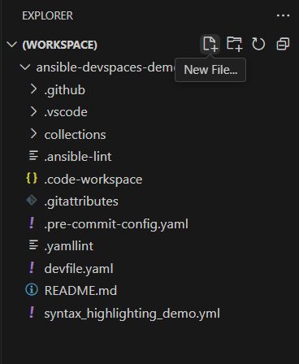

2. **Ubuntu 초기 설정 대기**

   처음 실행하면 Ubuntu가 자동으로 다운로드되고 설치됩니다:

   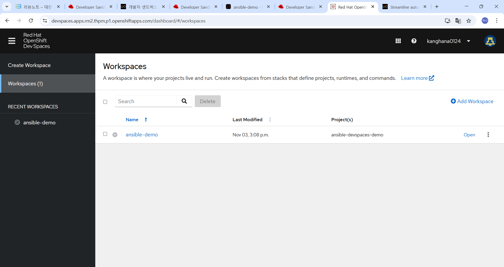

   ```
   다운로드 중: Ubuntu
   설치 중: Ubuntu
   배포가 설치되었습니다. 'wsl.exe -d Ubuntu'을(를) 통해 시작할 수 있습니다.
   Ubuntu 시작하는 중..
   Provisioning the new WSL instance Ubuntu
   This might take a while...
   ```

   이 과정은 몇 분 정도 소요될 수 있습니다.

3. **Unix 사용자 계정 생성**

   설치가 완료되면 기본 Unix 사용자 계정을 생성하라는 프롬프트가 나타납니다:

   ```
   Create a default Unix user account: your-username
   ```

   - **사용자 이름 입력**: 원하는 사용자 이름을 입력합니다 (예: `kanghana`)
   - **Enter 키 누르기**

4. **비밀번호 설정**

   비밀번호를 설정하라는 프롬프트가 나타납니다:

   ```
   New password:
   ```

   - 비밀번호를 입력합니다 (화면에 표시되지 않습니다)
   - **Enter 키 누르기**
   - 비밀번호를 다시 입력합니다:
     ```
     Retype new password:
     ```

   > **주의:** 비밀번호가 일치하지 않으면 다음 메시지가 표시됩니다:
   > ```
   > Sorry, passwords do not match.
   > passwd: Authentication token manipulation error
   > passwd: password unchanged
   > Try again? [y/N]
   > ```
   > 
   > `y`를 입력하여 다시 시도할 수 있습니다.

   비밀번호 설정이 성공하면 다음 메시지가 표시됩니다:

   ```
   passwd: password updated successfully
   ```

5. **설정 완료 확인**

   설정이 완료되면 다음과 같은 안내 메시지가 표시됩니다:

   ```
   To run a command as administrator (user "root"), use "sudo <command>".
   See "man sudo_root" for details.
   ```

   이제 터미널 프롬프트가 표시되며 Ubuntu 환경을 사용할 준비가 완료되었습니다:

   ```
   username@hostname:/mnt/c/WINDOWS/system32$
   ```

#### 단계 3: Ubuntu에서 Ansible 설치

Ubuntu 환경에서 Ansible을 설치합니다.

1. **패키지 목록 업데이트**

   ```bash
   sudo apt update
   ```

2. **Ansible 설치**

   ```bash
   sudo apt install ansible -y
   ```

   설치 과정에서 다음과 같은 패키지들이 함께 설치됩니다:
   - `python3-passlib`
   - `python3-ntlm-auth`
   - `python3-resolvelib`
   - `python3-kerberos`
   - `python3-simplejson`
   - `python3-xmltodict`
   - `python3-packaging`
   - `python3-jmespath`
   - `python3-dnspython`
   - `python3-selinux`
   - `python3-argcomplete`
   - `python3-requests-ntlm`
   - `python3-libcloud`
   - `python3-netaddr`
   - `python3-winrm`
   - `ansible-core`
   - `ansible`

3. **Ansible 버전 확인**

   설치가 완료되면 다음 명령어로 Ansible 버전을 확인합니다:

   ```bash
   ansible --version
   ```

   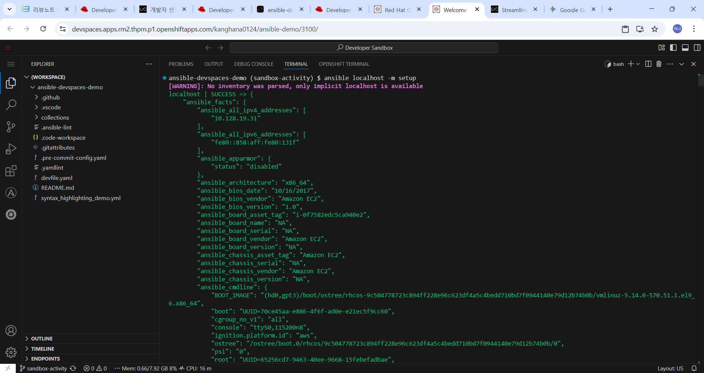

   예상 출력:

   ```
   ansible [core 2.16.3]
     config file = None
     configured module search path = ['/home/username/.ansible/plugins/modules', '/usr/share/ansible/plugins/modules']
     ansible python module location = /usr/lib/python3/dist-packages/ansible
     ansible collection location = /home/username/.ansible/collections:/usr/share/ansible/collections
     executable location = /usr/bin/ansible
     python version = 3.12.3 (main, Jun 18 2025, 17:59:45) [GCC 13.3.0] (/usr/bin/python3)
     jinja version = 3.1.2
     libyaml = True
   ```

   이 출력은 Ansible이 성공적으로 설치되었고, Python 3.12.3과 함께 작동 중임을 보여줍니다.

#### 단계 4: 로컬에서 플레이북 실행 테스트 (선택사항)

로컬 환경에서 간단한 플레이북을 실행하여 Ansible이 제대로 작동하는지 확인할 수 있습니다.

1. **프로젝트 디렉토리로 이동**

   ```bash
   cd /mnt/c/ansible-devspaces-demo
   ```

2. **플레이북 실행**

   ```bash
   ansible-playbook site.yml
   ```

   > **참고:** 이 단계는 `site.yml` 파일이 이미 존재하는 경우에만 가능합니다. 다음 섹션에서 플레이북을 작성하는 방법을 배울 것입니다.

3. **경고 메시지 확인**

   로컬에서 실행할 때 다음과 같은 경고 메시지가 나타날 수 있습니다:

   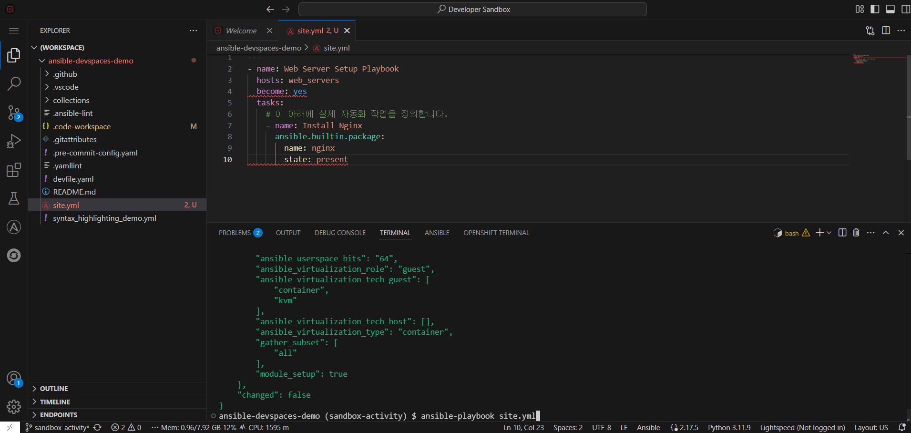

   ```
   [WARNING]: Ansible is being run in a world writable directory (/mnt/c/ansible-devspaces-demo), ignoring it as an ansible.cfg source.
   [WARNING]: No inventory was parsed, only implicit localhost is available.
   [WARNING]: provided hosts list is empty, only localhost is available.
   ```

   이 경고들은 일반적으로 무시해도 됩니다. 로컬 호스트에서 실행하는 경우에는 문제가 되지 않습니다.

---

### 다음 단계

로컬 개발 환경 설정이 완료되었습니다. 이제 Red Hat OpenShift Dev Spaces 환경을 설정할 준비가 되었습니다. 다음 섹션으로 이동하여 Developer Sandbox에 접속하고 워크스페이스를 생성하는 방법을 배워보겠습니다.

---

## Red Hat OpenShift Dev Spaces 환경 설정

이 섹션에서는 Red Hat Developer Sandbox에 접속하고 OpenShift Dev Spaces 워크스페이스를 생성하는 방법을 배웁니다. Dev Spaces는 클라우드 기반 개발 환경으로, 브라우저에서 완전한 IDE 환경을 제공합니다.

### 3.1 Developer Sandbox 접속

Red Hat Developer Sandbox는 개발자들이 Red Hat의 클라우드 서비스를 무료로 체험할 수 있는 환경입니다.

#### 단계 1: Sandbox 웹사이트 접속

1. 웹 브라우저에서 다음 URL로 이동합니다:
   - `https://sandbox.redhat.com`

2. **로그인 또는 가입**
   - Red Hat 계정이 있으면 로그인합니다
   - 계정이 없으면 새로 가입합니다

#### 단계 2: 환영 페이지 이해하기

로그인 후 환영 페이지가 표시됩니다:

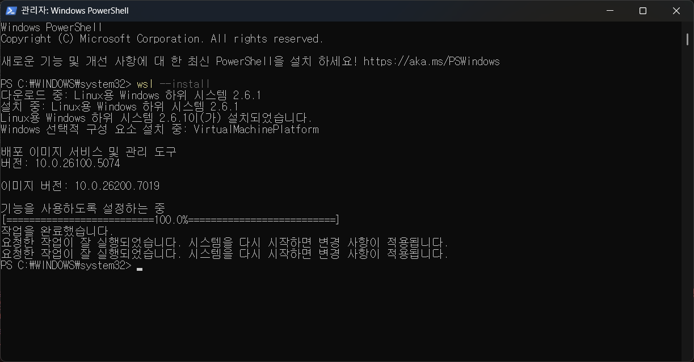

> **환영 페이지 주요 요소:**
> - 왼쪽 사이드바: Red Hat Developer 로고, Home, Activities, Settings 메뉴
> - 메인 영역 상단: "Developer Sandbox" 제목과 "powered by Red Hat Developer Hub" 설명
> - 환영 메시지: "Welcome, [사용자 이름]"과 체험 기간 안내
> - 제품 카드: OpenShift, OpenShift AI, Dev Spaces 세 가지 서비스 소개

**Dev Spaces 카드 정보:**

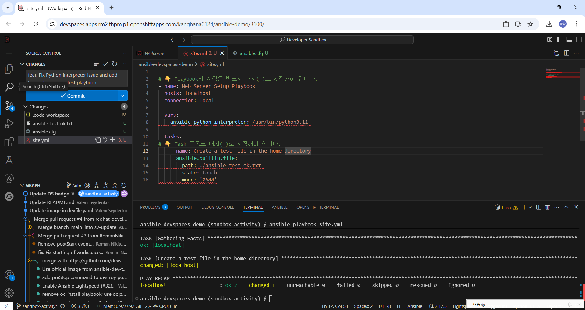
- **아이콘**: `< />` 코드 태그 심볼
- **제목**: "Dev Spaces"
- **주요 기능**:
  - Cloud Development Environment (클라우드 개발 환경)
  - Developer workspaces defined as code (코드로 정의된 개발자 워크스페이스)
  - Kubernetes development made easy (쿠버네티스 개발 간소화)
  - Near instant onboarding (거의 즉각적인 온보딩)
  - VS Code and JetBrains IDEs 지원

#### 단계 3: Dev Spaces 서비스 확인

환영 페이지에서 Dev Spaces 카드를 확인하면 클라우드 기반 개발 환경의 주요 특징을 이해할 수 있습니다.

> **팁:** Dev Spaces는 코드로 정의된 개발 환경을 제공하므로, `devfile.yaml` 파일을 통해 개발 환경을 일관되게 관리할 수 있습니다.

---

### 3.2 워크스페이스 생성

Dev Spaces에서 워크스페이스를 생성하여 개발 환경을 시작합니다.

#### 단계 1: Dev Spaces 대시보드 접속

1. **Dev Spaces 대시보드로 이동**
   - 브라우저에서 Dev Spaces URL로 이동합니다
   - 예: `devspaces.apps.rm2.thpm.p1.openshiftapps.com/dashboard/#/workspaces`

2. **대시보드 인터페이스 확인**

   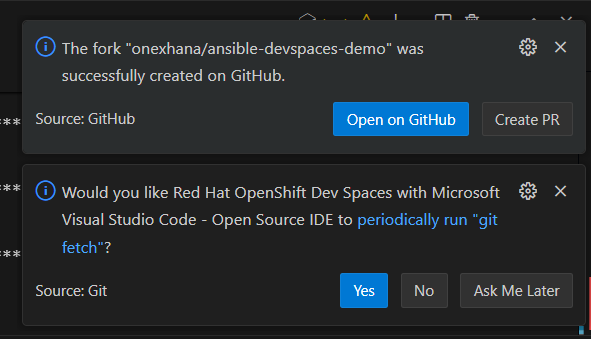

   대시보드의 주요 구성 요소:
   - **왼쪽 사이드바**: 
     - "Create Workspace" 버튼
     - "Workspaces (N)" 메뉴 항목 (N은 현재 워크스페이스 개수)
     - "RECENT WORKSPACES" 섹션
   - **메인 콘텐츠 영역**:
     - "Workspaces" 제목
     - 워크스페이스 설명 및 "Learn more" 링크
     - "+ Add Workspace" 버튼
     - 워크스페이스 목록 테이블

#### 단계 2: 새 워크스페이스 생성

1. **"Create Workspace" 버튼 클릭**
   - 왼쪽 사이드바 상단의 "Create Workspace" 버튼을 클릭합니다
   - 또는 메인 콘텐츠 영역의 "+ Add Workspace" 버튼을 클릭합니다

2. **Git 리포지토리 연결**
   - GitHub 리포지토리 URL을 입력합니다
   - 예: `https://github.com/your-username/ansible-devspaces-demo`
   - 또는 원본 리포지토리: `https://github.com/redhat-developer-demos/ansible-devspaces-demo`

3. **워크스페이스 이름 설정**
   - 워크스페이스 이름을 입력합니다 (예: `ansible-demo`)
   - 기본값으로 리포지토리 이름이 사용될 수 있습니다

4. **브랜치 선택**
   - 사용할 Git 브랜치를 선택합니다 (예: `sandbox-activity`)

5. **워크스페이스 생성**
   - "Create" 또는 "Create & Open" 버튼을 클릭합니다
   - 워크스페이스 생성이 시작됩니다

#### 단계 3: 워크스페이스 생성 완료 확인

워크스페이스 생성이 완료되면:

1. **워크스페이스 목록에서 확인**
   - 대시보드의 워크스페이스 목록에 새 워크스페이스가 표시됩니다
   - 예: "ansible-demo" 워크스페이스

2. **워크스페이스 정보 확인**
   - **Name**: 워크스페이스 이름 (예: "ansible-demo")
   - **Last Modified**: 마지막 수정 시간 (예: "Nov 03, 3:08 p.m.")
   - **Project(s)**: 연결된 프로젝트 이름 (예: "ansible-devspaces-demo")
   - **상태**: "Running" (실행 중) 또는 "Stopped" (정지됨)

3. **워크스페이스 열기**
   - 워크스페이스 목록에서 "Open" 버튼을 클릭합니다
   - 또는 워크스페이스 이름을 클릭합니다

---

### 3.3 워크스페이스 상세 정보 확인

워크스페이스를 생성한 후 상세 정보를 확인하고 관리할 수 있습니다.

#### 단계 1: 워크스페이스 상세 페이지 접속

1. **워크스페이스 목록에서 워크스페이스 선택**
   - 대시보드의 워크스페이스 목록에서 원하는 워크스페이스를 클릭합니다

2. **상세 페이지 확인**

   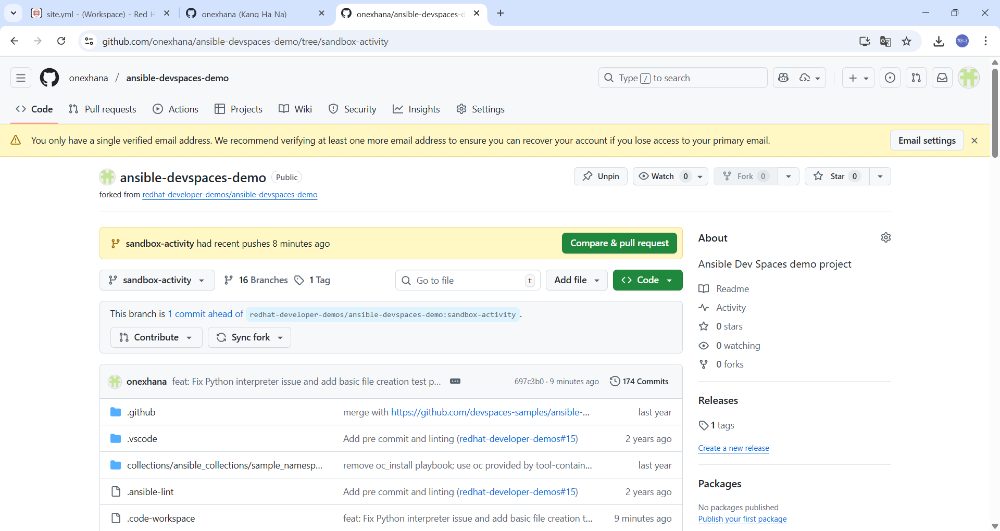

   상세 페이지의 주요 정보:
   - **경로 표시 (Breadcrumbs)**: "Workspaces > [워크스페이스 이름]"
   - **워크스페이스 제목**: 워크스페이스 이름
   - **상태 태그**: "Running" (실행 중) 또는 "Stopped" (정지됨)
   - **Actions 버튼**: 워크스페이스 관리 옵션

#### 단계 2: 탭 메뉴 탐색

워크스페이스 상세 페이지에는 여러 탭이 있습니다:

- **Overview**: 워크스페이스 기본 정보
- **Devfile**: `devfile.yaml` 파일 내용
- **Logs**: 워크스페이스 로그
- **Events**: 워크스페이스 이벤트

#### 단계 3: Overview 정보 확인

**Overview 탭**에서 다음 정보를 확인할 수 있습니다:

- **Workspace**: 워크스페이스 이름 (클릭 가능한 링크)
- **Kubernetes Namespace**: 워크스페이스가 실행되는 Kubernetes 네임스페이스
  - 예: `username-dev` (예: `kanghana0124-dev`)
- **Storage Type**: 저장소 타입 (예: "per-user")
- **Projects**: 연결된 프로젝트 목록
  - 예: "ansible-devspaces-demo"
- **Git repo URL**: 연결된 Git 저장소 URL
  - 예: `redhat-developer-demos/ansible-devspaces-demo/tree/sandbox-activity`
  - 클립보드 아이콘으로 URL 복사 가능

#### 단계 4: 워크스페이스 상태 관리

워크스페이스는 다음 상태를 가질 수 있습니다:

- **Running**: 워크스페이스가 실행 중이며 IDE에 접속할 수 있습니다
- **Stopped**: 워크스페이스가 정지되어 있으며, "Open" 버튼을 클릭하여 다시 시작할 수 있습니다

> **팁:** 워크스페이스를 정지하면 리소스를 절약할 수 있으며, 필요할 때 언제든 다시 시작할 수 있습니다.

---

### 다음 단계

워크스페이스 생성이 완료되었습니다. 이제 Dev Spaces IDE 환경을 사용하여 Ansible 플레이북을 작성하고 실행할 준비가 되었습니다. 다음 섹션으로 이동하여 IDE 인터페이스를 익히고 프로젝트 구조를 이해해보겠습니다.

---

## Dev Spaces IDE 환경 익히기

워크스페이스를 열면 Visual Studio Code와 유사한 IDE 인터페이스가 브라우저에서 실행됩니다. 이 섹션에서는 IDE의 주요 구성 요소와 프로젝트 구조를 이해하는 방법을 배웁니다.

### 4.1 IDE 인터페이스 소개

Dev Spaces IDE는 VS Code와 유사한 인터페이스를 제공합니다. 주요 구성 요소를 살펴보겠습니다.

#### 단계 1: IDE 레이아웃 이해

워크스페이스를 열면 다음과 같은 레이아웃이 표시됩니다:

**주요 구성 요소:**

1. **왼쪽 사이드바 (Activity Bar)**
   - 파일 탐색기 아이콘 (폴더 모양)
   - 검색 아이콘
   - 소스 제어 아이콘 (Git 브랜치 모양)
   - 실행 및 디버그 아이콘
   - 확장 프로그램 아이콘
   - 계정 아이콘

2. **파일 탐색기 패널 (Explorer)**
   - **EXPLORER** 섹션: 프로젝트 파일 및 폴더 구조 표시
   - **OUTLINE** 섹션: 현재 열린 파일의 구조 표시
   - **TIMELINE** 섹션: 파일 변경 이력 표시
   - **ENDPOINTS** 섹션: 워크스페이스 엔드포인트 정보

3. **중앙 편집기 영역**
   - 파일 탭: 열린 파일 목록
   - 코드 편집기: 파일 내용 편집
   - 라인 번호 및 구문 강조 지원

4. **하단 패널**
   - **PROBLEMS**: 오류 및 경고 표시
   - **OUTPUT**: 명령어 출력 표시
   - **DEBUG CONSOLE**: 디버그 콘솔
   - **TERMINAL**: 터미널 실행
   - **ANSIBLE**: Ansible 관련 출력
   - **OPENSHIFT TERMINAL**: OpenShift 터미널

5. **상단 메뉴 바**
   - File, Edit, Selection, View, Go, Run, Terminal, Help 메뉴

#### 단계 2: 파일 탐색기 사용

1. **프로젝트 구조 보기**
   - 왼쪽 사이드바의 파일 탐색기 아이콘을 클릭합니다
   - **EXPLORER** 섹션에서 프로젝트 폴더와 파일 목록을 확인합니다

   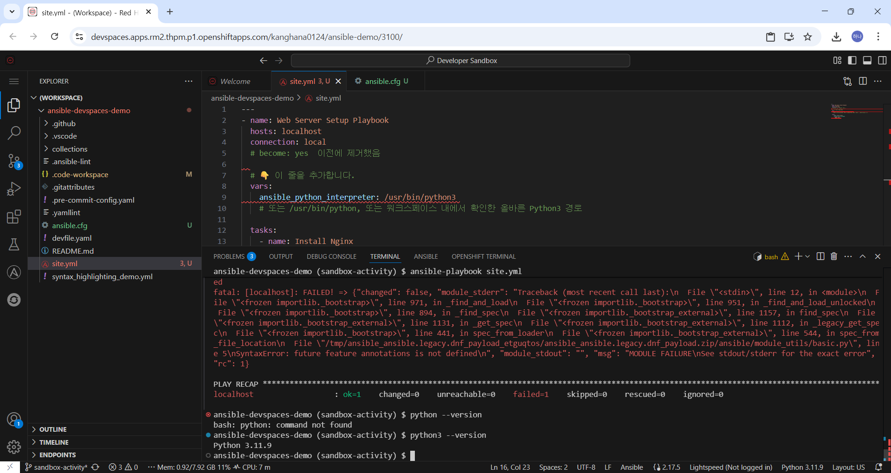

2. **파일 열기**
   - 파일 목록에서 파일을 클릭하면 중앙 편집기에서 열립니다
   - 여러 파일을 동시에 열 수 있으며, 각 파일은 탭으로 표시됩니다

3. **파일 생성**
   - 파일 탐색기에서 폴더를 마우스 오른쪽 버튼으로 클릭합니다
   - "New File" 또는 "New Folder" 옵션을 선택합니다
   - 또는 상단 메뉴에서 **File > New File**을 선택합니다

   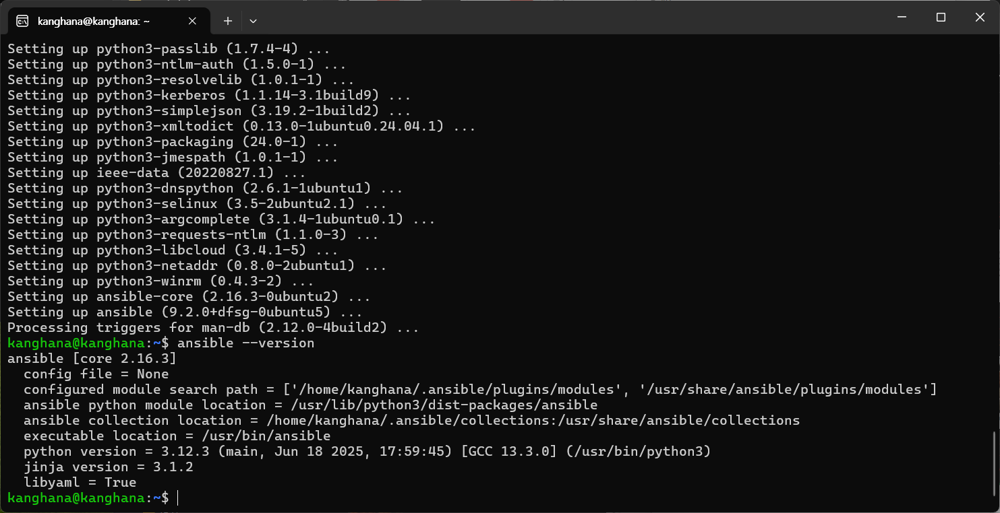

#### 단계 3: 터미널 사용

1. **터미널 열기**
   - 하단 패널의 **TERMINAL** 탭을 클릭합니다
   - 또는 상단 메뉴에서 **Terminal > New Terminal**을 선택합니다
   - 단축키: `` Ctrl+` `` (백틱)

2. **터미널 명령어 실행**
   - 터미널에서 Linux 명령어를 실행할 수 있습니다
   - 예: `ls`, `pwd`, `cd`, `ansible --version` 등

#### 단계 4: 소스 제어 패널 사용

1. **소스 제어 패널 열기**
   - 왼쪽 사이드바의 소스 제어 아이콘을 클릭합니다

2. **변경사항 확인**
   - **CHANGES** 섹션에서 수정된 파일 목록을 확인합니다
   - 파일 옆의 아이콘으로 상태를 확인할 수 있습니다:
     - **M** (Modified): 수정된 파일
     - **U** (Untracked): 추적되지 않은 새 파일
     - **A** (Added): 추가된 파일

3. **커밋 준비**
   - 변경사항을 스테이징하고 커밋할 수 있습니다
   - 자세한 내용은 "Git 작업 및 버전 관리" 섹션에서 다룹니다

---

### 4.2 프로젝트 구조 이해

프로젝트의 주요 파일과 디렉토리 구조를 이해하는 것은 Ansible 개발에 중요합니다.

#### 단계 1: 주요 디렉토리 구조

프로젝트 루트 디렉토리에는 다음과 같은 구조가 있습니다:

```
ansible-devspaces-demo/
├── .github/              # GitHub 워크플로우 및 설정
├── .vscode/              # VS Code 설정
├── collections/          # Ansible 컬렉션
│   └── ansible_collections/
│       └── sample_namespace/
│           └── sample_collection/
│               ├── extensions/  # Molecule 테스트 설정
│               ├── roles/       # Ansible 역할
│               └── ...
├── .ansible-lint          # Ansible Lint 설정
├── .code-workspace        # VS Code 워크스페이스 설정
├── .gitattributes         # Git 속성 설정
├── .pre-commit-config.yaml # Pre-commit 훅 설정
├── .yamllint             # YAML Lint 설정
├── ansible.cfg            # Ansible 설정 파일
├── devfile.yaml           # Dev Spaces 환경 정의
├── README.md              # 프로젝트 설명서
├── site.yml               # 메인 Ansible 플레이북
└── syntax_highlighting_demo.yml # 구문 강조 예제
```

#### 단계 2: devfile.yaml 이해

`devfile.yaml` 파일은 Dev Spaces 환경을 정의하는 파일입니다.

**주요 구성 요소:**

- **schemaVersion**: Devfile 스키마 버전
- **metadata**: 워크스페이스 메타데이터 (이름 등)
- **components**: 개발 환경 구성 요소
  - **container**: 컨테이너 이미지 및 리소스 설정
  - **image**: Ansible 개발 환경 이미지
  - **memoryRequest/Limit**: 메모리 요청/제한
  - **cpuRequest/Limit**: CPU 요청/제한
  - **env**: 환경 변수 설정
- **commands**: 실행 가능한 명령어 정의 (Molecule 테스트 등)
- **events**: 워크스페이스 이벤트 처리

> **참고:** `devfile.yaml`은 코드로 정의된 개발 환경을 제공하므로, 모든 개발자가 동일한 환경에서 작업할 수 있습니다.

#### 단계 3: ansible.cfg 설정

`ansible.cfg` 파일은 Ansible의 기본 설정을 정의합니다.

**주요 설정:**

```ini
[defaults]
inventory = ./hosts
host_key_checking = False

[python]
interpreter_python = /usr/bin/python3.11
```

- **inventory**: 인벤토리 파일 경로
- **host_key_checking**: SSH 호스트 키 확인 비활성화 (개발 환경용)
- **interpreter_python**: Python 인터프리터 경로

> **팁:** `interpreter_python` 설정은 플레이북에서 Python 인터프리터 경로를 지정하지 않은 경우 기본값으로 사용됩니다.

#### 단계 4: 컬렉션 구조 이해

`collections/ansible_collections/sample_namespace/sample_collection/` 디렉토리에는 샘플 Ansible 컬렉션이 포함되어 있습니다:

- **extensions/molecule/**: Molecule 테스트 설정
- **roles/backup_file/**: 샘플 Ansible 역할
  - `tasks/main.yml`: 역할의 주요 작업 정의
  - `defaults/main.yml`: 기본 변수 정의
  - `handlers/main.yml`: 핸들러 정의
  - `meta/main.yml`: 역할 메타데이터
  - `tests/`: 테스트 파일

---

### 다음 단계

IDE 인터페이스와 프로젝트 구조를 이해했습니다. 이제 첫 번째 Ansible 플레이북을 작성하고 실행하는 방법을 배워보겠습니다.

---

## Ansible 플레이북 작성 및 실행

이 섹션에서는 Ansible 플레이북을 작성하고 실행하는 방법을 단계별로 배웁니다. 첫 번째 플레이북으로 간단한 파일 생성 작업을 수행하는 플레이북을 만들어보겠습니다.

### 5.1 첫 번째 플레이북 작성

Ansible 플레이북은 YAML 형식으로 작성되며, 시스템에 대한 자동화 작업을 정의합니다.

#### 단계 1: site.yml 파일 생성

1. **파일 탐색기에서 새 파일 생성**
   - 파일 탐색기에서 프로젝트 루트 디렉토리를 선택합니다
   - 상단 메뉴에서 **File > New File**을 선택합니다
   - 또는 파일 탐색기의 "+" 아이콘을 클릭합니다

2. **파일 이름 지정**
   - 파일 이름을 `site.yml`로 지정합니다

> **참고:** `site.yml`은 Ansible 프로젝트에서 일반적으로 사용되는 메인 플레이북 파일 이름입니다.

#### 단계 2: YAML 문법 기본

Ansible 플레이북은 YAML 형식으로 작성되며, 다음 규칙을 따라야 합니다:

- **들여쓰기**: 스페이스 2개 또는 4개 사용 (일관되게 유지)
- **대시(-)**: 리스트 항목을 나타냄
- **콜론(:)**: 키-값 쌍을 나타냄
- **하이픈 3개(---)**: YAML 문서 시작 (선택사항이지만 권장)

#### 단계 3: 플레이북 구조 작성

다음은 기본 플레이북 구조입니다:

```yaml
---
# Playbook의 시작은 반드시 대시(-)로 시작해야 합니다.
- name: Web Server Setup Playbook
  hosts: localhost
  connection: local

  vars:
    ansible_python_interpreter: /usr/bin/python3

  tasks:
# Task 목록도 대시(-)로 시작해야 합니다.
    - name: Create a test file in the home directory
      ansible.builtin.file:
        path: ~/ansible_test_ok.txt
        state: touch
        mode: '0644'
```

**플레이북 구조 설명:**

1. **`---`**: YAML 문서 시작 표시 (선택사항)

2. **`- name:`**: 플레이북 이름
   - 플레이북의 목적을 설명하는 이름
   - 예: "Web Server Setup Playbook"

3. **`hosts:`**: 대상 호스트
   - 플레이북이 실행될 대상 호스트 또는 호스트 그룹
   - 예: `localhost`, `web_servers`, `all`

4. **`connection:`**: 연결 방식
   - `local`: 로컬 연결 (SSH를 사용하지 않음)
   - `ssh`: SSH 연결 (기본값)

5. **`vars:`**: 변수 정의
   - 플레이북에서 사용할 변수를 정의
   - 예: `ansible_python_interpreter`: Python 인터프리터 경로

6. **`tasks:`**: 작업 목록
   - 실행할 작업들을 정의
   - 각 작업은 `- name:`으로 시작

#### 단계 4: 작업(Task) 작성

작업은 플레이북에서 수행할 개별 작업을 정의합니다.

**작업 구조:**

```yaml
- name: 작업 이름 (사람이 읽을 수 있는 설명)
  모듈명:
    파라미터1: 값1
    파라미터2: 값2
```

**예제 작업 설명:**

```yaml
- name: Create a test file in the home directory
  ansible.builtin.file:
    path: ~/ansible_test_ok.txt
    state: touch
    mode: '0644'
```

- **`name:`**: 작업의 설명 (사람이 읽을 수 있는 이름)
- **`ansible.builtin.file:`**: Ansible의 파일 모듈 사용
- **`path:`**: 파일 경로 (예: `~/ansible_test_ok.txt`는 홈 디렉토리의 파일)
- **`state: touch`**: 파일이 없으면 생성, 있으면 수정 시간만 업데이트
- **`mode: '0644'`**: 파일 권한 설정 (읽기/쓰기 가능, 소유자만)

> **참고:** `ansible.builtin.file` 모듈은 파일 및 디렉토리 관리를 위한 Ansible의 내장 모듈입니다.

---

### 5.2 Python 인터프리터 설정

Ansible은 Python을 사용하여 작업을 실행하므로, 올바른 Python 인터프리터 경로를 설정하는 것이 중요합니다.

#### 단계 1: Python 경로 확인

터미널에서 Python 경로를 확인합니다:

```bash
python3 --version
```

예상 출력:

```
Python 3.11.9
```

또는 Python 경로를 직접 확인:

```bash
which python3
```

예상 출력:

```
/usr/bin/python3
```

#### 단계 2: 플레이북에서 Python 인터프리터 설정

플레이북의 `vars` 섹션에서 Python 인터프리터 경로를 지정합니다:

```yaml
vars:
  ansible_python_interpreter: /usr/bin/python3
```

> **참고:** Dev Spaces 환경에서는 일반적으로 `/usr/bin/python3`를 사용합니다. 환경에 따라 경로가 다를 수 있으므로, `which python3` 명령어로 확인하는 것이 좋습니다.

#### 단계 3: 일반적인 Python 경로 옵션

다양한 환경에서 사용할 수 있는 Python 경로:

- `/usr/bin/python3`: 일반적인 Linux 시스템
- `/usr/bin/python3.11`: 특정 버전 지정
- `/usr/bin/python`: Python 2 또는 3 (시스템에 따라 다름)
- `python3`: PATH에 있는 경우 (상대 경로)

> **주의:** Python 2는 더 이상 지원되지 않으므로, Python 3를 사용해야 합니다.

---

### 5.3 플레이북 실행

플레이북을 작성한 후 실행하여 작업이 제대로 수행되는지 확인합니다.

#### 단계 1: 터미널에서 플레이북 실행

1. **터미널 열기**
   - 하단 패널의 **TERMINAL** 탭을 클릭합니다
   - 또는 상단 메뉴에서 **Terminal > New Terminal**을 선택합니다

2. **플레이북 실행 명령어**

   ```bash
   ansible-playbook site.yml
   ```

3. **실행 결과 확인**

   플레이북이 성공적으로 실행되면 다음과 같은 출력이 표시됩니다:

   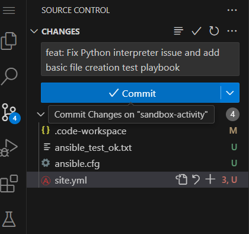

   ```
   PLAY [Web Server Setup Playbook] *****************************************

   TASK [Gathering Facts] **************************************************
   ok: [localhost]

   TASK [Create a test file in the home directory] **************************
   changed: [localhost]

   PLAY RECAP **************************************************************
   localhost                  : ok=2    changed=1    unreachable=0    failed=0    skipped=0    rescued=0    ignored=0
   ```

   

   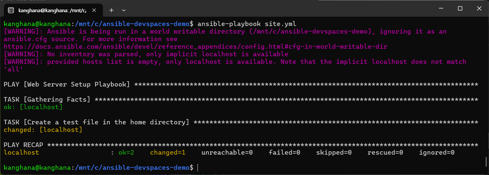

#### 단계 2: 실행 결과 해석

**플레이북 실행 출력 설명:**

1. **`PLAY [Web Server Setup Playbook]`**
   - 플레이북 실행 시작
   - 플레이북 이름이 표시됩니다

2. **`TASK [Gathering Facts]`**
   - Ansible이 대상 시스템의 정보를 수집하는 작업
   - `ok: [localhost]`: 정보 수집 성공

3. **`TASK [Create a test file in the home directory]`**
   - 플레이북에서 정의한 실제 작업 실행
   - `changed: [localhost]`: 작업이 시스템에 변경사항을 발생시킴

4. **`PLAY RECAP`**
   - 플레이북 실행 요약
   - **`ok=2`**: 성공적으로 완료된 작업 수 (Facts 수집 + 파일 생성)
   - **`changed=1`**: 시스템에 변경을 발생시킨 작업 수
   - **`unreachable=0`**: 접근할 수 없었던 호스트 수
   - **`failed=0`**: 실패한 작업 수
   - **`skipped=0`**: 건너뛴 작업 수
   - **`rescued=0`**: 복구된 작업 수
   - **`ignored=0`**: 무시된 작업 수

#### 단계 3: 성공 확인

플레이북이 성공적으로 실행되면:

1. **파일 생성 확인**

   터미널에서 다음 명령어로 파일이 생성되었는지 확인합니다:

   ```bash
   ls -l ~/ansible_test_ok.txt
   ```

   예상 출력:

   ```
   -rw-r--r-- 1 username username 0 Nov  3 15:30 /home/username/ansible_test_ok.txt
   ```

2. **파일 내용 확인 (선택사항)**

   ```bash
   cat ~/ansible_test_ok.txt
   ```

   파일이 비어있으면 정상입니다 (touch 작업으로 생성된 파일).

#### 단계 4: 다시 실행하기

플레이북을 다시 실행하면:

```
PLAY [Web Server Setup Playbook] *****************************************

TASK [Gathering Facts] **************************************************
ok: [localhost]

TASK [Create a test file in the home directory] **************************
ok: [localhost]

PLAY RECAP **************************************************************
localhost                  : ok=2    changed=0    unreachable=0    failed=0    skipped=0    rescued=0    ignored=0
```

이번에는 `changed=0`이 표시됩니다. 파일이 이미 존재하므로 변경사항이 없기 때문입니다.

> **참고:** Ansible은 **멱등성(idempotency)**을 보장합니다. 즉, 같은 작업을 여러 번 실행해도 결과가 동일하며, 필요한 경우에만 변경을 수행합니다.

---

### 5.4 시스템 정보 수집

Ansible은 시스템 정보를 수집하여 플레이북에서 활용할 수 있습니다. 이를 Ansible Facts라고 합니다.

#### 단계 1: Facts 수집 명령어 실행

터미널에서 다음 명령어를 실행합니다:

```bash
ansible localhost -m setup
```

이 명령어는 `localhost`에 대해 `setup` 모듈을 실행하여 시스템 정보를 수집합니다.

#### 단계 2: 경고 메시지 이해

명령어 실행 시 다음과 같은 경고가 나타날 수 있습니다:

```
[WARNING]: No inventory was parsed, only implicit localhost is available.
[WARNING]: provided hosts list is empty, only localhost is available.
```

이 경고들은 일반적으로 무시해도 됩니다. 로컬 호스트에서 실행하는 경우에는 문제가 되지 않습니다.

#### 단계 3: Facts 출력 확인

명령어가 성공하면 다음과 같은 JSON 형식의 출력이 표시됩니다:

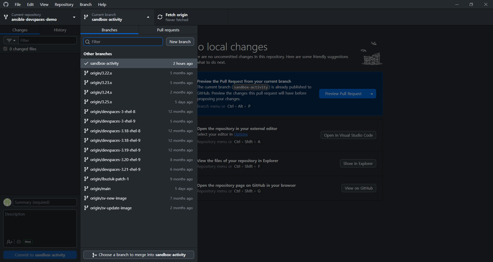

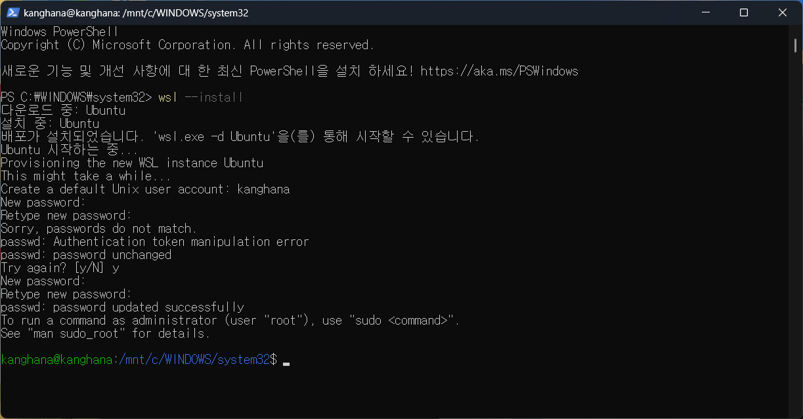

```
localhost | SUCCESS => {
    "ansible_facts": {
        "ansible_all_ipv4_addresses": ["10.128.19.31"],
        "ansible_all_ipv6_addresses": ["fe80::858:aff:fe80:131f"],
        "ansible_apparmor": {"status": "disabled"},
        "ansible_architecture": "x86_64",
        "ansible_bios_date": "10/16/2017",
        "ansible_bios_vendor": "Amazon EC2",
        "ansible_bios_version": "1.0",
        ...
    },
    "changed": false
}
```

**주요 Facts 정보:**

- **`ansible_all_ipv4_addresses`**: 모든 IPv4 주소
- **`ansible_all_ipv6_addresses`**: 모든 IPv6 주소
- **`ansible_architecture`**: 시스템 아키텍처 (예: x86_64)
- **`ansible_bios_*`**: BIOS 정보
- **`ansible_distribution`**: Linux 배포판 이름
- **`ansible_distribution_version`**: 배포판 버전
- **`ansible_os_family`**: 운영체제 계열
- **`ansible_python_version`**: Python 버전
- 기타 많은 시스템 정보

#### 단계 4: Facts 활용

플레이북에서 Facts를 사용하려면 변수로 참조할 수 있습니다:

```yaml
- name: Display system information
  ansible.builtin.debug:
    msg: "System architecture is {{ ansible_architecture }}"
```

> **참고:** `setup` 모듈은 플레이북 실행 시 자동으로 실행되며, Facts가 자동으로 수집됩니다. 명시적으로 `gather_facts: no`를 설정하지 않는 한 항상 실행됩니다.

---

### 다음 단계

플레이북 작성 및 실행 방법을 배웠습니다. 이제 일반적인 문제와 해결 방법을 배워보겠습니다.

---

## 문제 해결 및 디버깅

Ansible 플레이북을 작성하고 실행하는 과정에서 다양한 오류나 경고가 발생할 수 있습니다. 이 섹션에서는 일반적인 문제와 해결 방법을 다룹니다.

### 6.1 일반적인 오류

플레이북 실행 중 발생할 수 있는 일반적인 오류와 해결 방법을 살펴보겠습니다.

#### 문제 1: Python 인터프리터 경로 오류

**증상:**

플레이북 실행 시 다음과 같은 오류가 발생할 수 있습니다:

```
fatal: [localhost]: FAILED! => {
    "msg": "Failed to import required Python library (ansible.module_utils.basic) on localhost. Please read module documentation and install in the appropriate location."
}
```

**원인:**

- Python 인터프리터 경로가 잘못되었거나
- Python이 설치되지 않았거나
- Ansible이 Python을 찾을 수 없는 경우

**해결 방법:**

1. **Python 경로 확인**

   ```bash
   python3 --version
   which python3
   ```

2. **플레이북에서 Python 인터프리터 설정**

   ```yaml
   vars:
     ansible_python_interpreter: /usr/bin/python3
   ```

3. **ansible.cfg에서 전역 설정**

   `ansible.cfg` 파일에 다음을 추가:

   ```ini
   [python]
   interpreter_python = /usr/bin/python3
   ```

#### 문제 2: SyntaxError: future feature annotations is not defined

**증상:**

플레이북 실행 시 다음과 같은 오류가 발생할 수 있습니다:

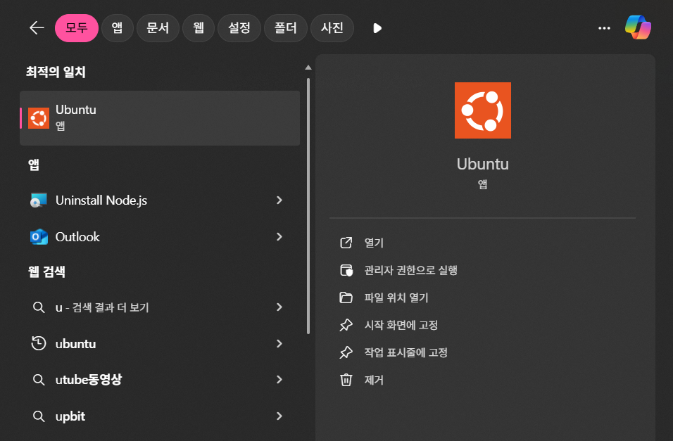

```
fatal: [localhost]: FAILED! => {
    "msg": "An exception occurred during task execution. To see the full traceback, use -vvv. The error was: SyntaxError: future feature annotations is not defined"
}
```

**원인:**

- Python 버전이 너무 낮거나
- Ansible이 지원하지 않는 Python 버전을 사용하는 경우

**해결 방법:**

1. **Python 버전 확인**

   ```bash
   python3 --version
   ```

   Python 3.8 이상이 필요합니다.

2. **올바른 Python 인터프리터 경로 지정**

   ```yaml
   vars:
     ansible_python_interpreter: /usr/bin/python3
   ```

   또는 특정 버전 지정:

   ```yaml
   vars:
     ansible_python_interpreter: /usr/bin/python3.11
   ```

3. **ansible.cfg에서 설정**

   ```ini
   [python]
   interpreter_python = /usr/bin/python3.11
   ```

#### 문제 3: 인벤토리 경고 메시지

**증상:**

플레이북 실행 시 다음과 같은 경고가 나타납니다:

```
[WARNING]: No inventory was parsed, only implicit localhost is available.
[WARNING]: provided hosts list is empty, only localhost is available.
```

**원인:**

- 인벤토리 파일이 지정되지 않았거나
- 인벤토리 파일을 찾을 수 없는 경우

**해결 방법:**

1. **경고 무시 (로컬 호스트 사용 시)**

   로컬 호스트에서만 작업하는 경우 이 경고는 무시해도 됩니다. 플레이북이 정상적으로 실행됩니다.

2. **인벤토리 파일 생성 (선택사항)**

   `hosts` 파일을 생성하여 호스트를 정의할 수 있습니다:

   ```ini
   [local]
   localhost ansible_connection=local
   ```

3. **ansible.cfg에서 인벤토리 경로 지정**

   ```ini
   [defaults]
   inventory = ./hosts
   ```

#### 문제 4: 세계 쓰기 가능 디렉토리 경고

**증상:**

플레이북 실행 시 다음과 같은 경고가 나타납니다:

```
[WARNING]: Ansible is being run in a world writable directory (/mnt/c/ansible-devspaces-demo), ignoring it as an ansible.cfg source.
```

**원인:**

- 프로젝트 디렉토리가 모든 사용자가 쓰기 가능한 권한을 가지고 있는 경우
- Windows 파일 시스템(WSL 마운트)에서 일반적으로 발생

**해결 방법:**

1. **경고 무시**

   이 경고는 보안 경고일 뿐이며, 로컬 개발 환경에서는 일반적으로 무시해도 됩니다.

2. **디렉토리 권한 수정 (선택사항)**

   ```bash
   chmod 755 /mnt/c/ansible-devspaces-demo
   ```

   > **참고:** WSL에서 Windows 파일 시스템의 권한은 제한적으로 적용될 수 있습니다.

#### 문제 5: 파일 경로 오류

**증상:**

플레이북 실행 시 파일을 찾을 수 없다는 오류가 발생합니다:

```
fatal: [localhost]: FAILED! => {
    "msg": "Failed to get information on remote file (/path/to/file): file does not exist"
}
```

**원인:**

- 파일 경로가 잘못되었거나
- 파일이 존재하지 않는 경우

**해결 방법:**

1. **파일 경로 확인**

   ```bash
   ls -l /path/to/file
   ```

2. **상대 경로 사용**

   ```yaml
   path: ./ansible_test_ok.txt
   ```

3. **홈 디렉토리 경로 사용**

   ```yaml
   path: ~/ansible_test_ok.txt
   ```

---

### 6.2 디버깅 방법

플레이북 실행 중 문제가 발생하면 디버깅을 통해 원인을 파악할 수 있습니다.

#### 방법 1: 상세 출력 옵션 사용

플레이북 실행 시 상세 출력을 활성화하여 더 많은 정보를 확인할 수 있습니다:

```bash
ansible-playbook site.yml -vvv
```

**출력 레벨:**

- `-v`: 기본 상세 출력
- `-vv`: 더 상세한 출력
- `-vvv`: 매우 상세한 출력 (디버깅에 유용)
- `-vvvv`: 연결 디버깅 정보 포함

#### 방법 2: 문제 패널 확인

Dev Spaces IDE에서 **PROBLEMS** 패널을 확인하여 YAML 문법 오류나 경고를 확인할 수 있습니다:

1. **PROBLEMS 패널 열기**
   - 하단 패널의 **PROBLEMS** 탭을 클릭합니다
   - 또는 `Ctrl+Shift+M` 단축키 사용

2. **오류 확인**
   - 파일 이름 옆의 숫자는 문제 개수를 나타냅니다
   - 예: `site.yml 3` (3개의 문제)
   - 각 오류를 클릭하면 해당 위치로 이동합니다

#### 방법 3: 터미널 출력 분석

플레이북 실행 시 터미널 출력을 자세히 분석하여 문제를 파악할 수 있습니다:

1. **실행 결과 전체 확인**
   - 터미널 출력을 스크롤하여 모든 메시지를 확인합니다
   - 특히 `FAILED` 또는 `ERROR` 메시지를 찾습니다

2. **스택 트레이스 확인**
   - 오류 발생 시 스택 트레이스가 출력됩니다
   - 스택 트레이스를 통해 오류 발생 위치를 확인할 수 있습니다

3. **PLAY RECAP 확인**
   - `PLAY RECAP` 섹션에서 실패한 작업을 확인합니다
   - `failed=1`이면 실패한 작업이 있습니다

#### 방법 4: 체크 모드로 실행

플레이북을 실제로 변경하지 않고 실행하여 어떤 작업이 수행될지 확인할 수 있습니다:

```bash
ansible-playbook site.yml --check
```

**체크 모드 특징:**

- 실제로 시스템을 변경하지 않습니다
- 어떤 작업이 수행될지 시뮬레이션합니다
- `--check` 옵션과 함께 `--diff` 옵션을 사용하면 변경사항을 확인할 수 있습니다

#### 방법 5: 특정 작업만 실행

플레이북의 특정 작업만 실행하여 디버깅할 수 있습니다:

```bash
ansible-playbook site.yml --start-at-task "Create a test file"
```

**유용한 옵션:**

- `--start-at-task`: 특정 작업부터 시작
- `--step`: 각 작업을 단계별로 확인
- `--tags`: 태그가 지정된 작업만 실행

---

### 다음 단계

문제 해결 및 디버깅 방법을 배웠습니다. 이제 Git을 사용하여 변경사항을 관리하는 방법을 배워보겠습니다.

---

## Git 작업 및 버전 관리

이 섹션에서는 Git을 사용하여 변경사항을 커밋하고 관리하는 방법을 배웁니다. Dev Spaces IDE의 소스 제어 기능을 활용하여 버전 관리를 수행할 수 있습니다.

### 7.1 변경사항 커밋

Dev Spaces IDE의 소스 제어 패널을 사용하여 변경사항을 커밋할 수 있습니다.

#### 단계 1: 소스 제어 패널 열기

1. **소스 제어 아이콘 클릭**
   - 왼쪽 사이드바의 소스 제어 아이콘(Git 브랜치 모양)을 클릭합니다
   - 또는 `Ctrl+Shift+G` 단축키를 사용합니다

2. **변경사항 확인**
   - **CHANGES** 섹션에서 수정된 파일 목록을 확인합니다

   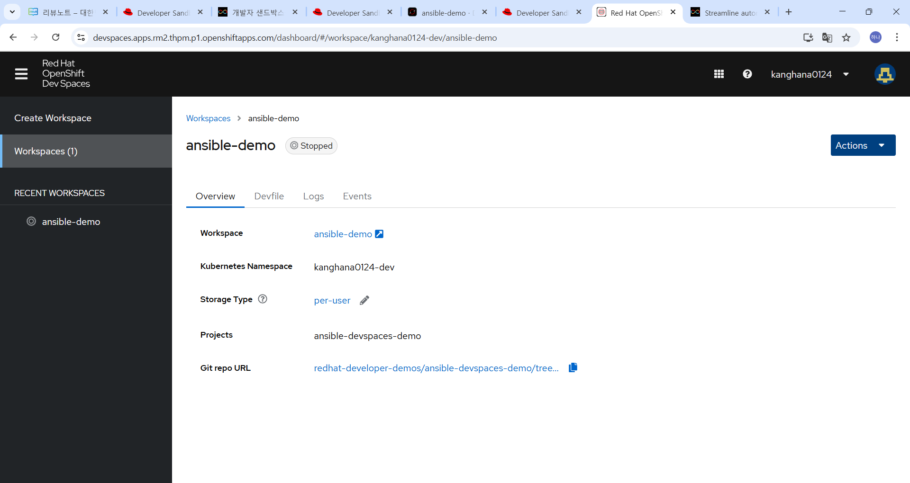

   - 파일 옆의 아이콘으로 상태를 확인할 수 있습니다:
     - **M** (Modified): 수정된 파일
     - **U** (Untracked): 추적되지 않은 새 파일
     - **A** (Added): 추가된 파일

#### 단계 2: 변경사항 스테이징

1. **파일 스테이징**
   - 변경사항 목록에서 커밋할 파일을 선택합니다
   - 파일 옆의 **"+"** 아이콘을 클릭하여 스테이징합니다
   - 또는 파일을 마우스 오른쪽 버튼으로 클릭하고 **"Stage Changes"**를 선택합니다

2. **모든 변경사항 스테이징**
   - **CHANGES** 섹션 제목 옆의 **"+"** 아이콘을 클릭하여 모든 변경사항을 스테이징합니다

#### 단계 3: 커밋 메시지 작성

1. **커밋 메시지 입력 필드 찾기**
   - 소스 제어 패널 상단에 커밋 메시지 입력 필드가 있습니다

2. **커밋 메시지 작성**
   - 변경사항을 설명하는 명확한 메시지를 작성합니다
   - 예: `feat: Fix Python interpreter issue and add basic file creation test playbook`
   - 또는: `fix: Update Python interpreter path in site.yml`

**커밋 메시지 작성 규칙:**

- **제목**: 간결하고 명확하게 (50자 이내 권장)
- **본문** (선택사항): 변경사항에 대한 상세 설명
- **접두사 사용** (권장):
  - `feat:`: 새로운 기능 추가
  - `fix:`: 버그 수정
  - `docs:`: 문서 수정
  - `style:`: 코드 스타일 변경
  - `refactor:`: 코드 리팩토링
  - `test:`: 테스트 추가
  - `chore:`: 기타 작업

#### 단계 4: 커밋 실행

1. **커밋 버튼 클릭**
   - 커밋 메시지 입력 필드 위에 **"Commit"** 버튼을 클릭합니다
   - 또는 `Ctrl+Enter` 단축키를 사용합니다

2. **커밋 확인**
   - 커밋이 완료되면 변경사항 목록에서 해당 파일이 사라집니다
   - 소스 제어 패널의 **GRAPH** 뷰에서 커밋 히스토리를 확인할 수 있습니다

#### 단계 5: 커밋된 파일 확인

**예제 커밋 파일 목록:**

- `.code-workspace` (M - Modified): 워크스페이스 설정 수정
- `ansible_test_ok.txt` (U - Untracked): 새로 생성된 테스트 파일
- `ansible.cfg` (U - Untracked): 새로 생성된 Ansible 설정 파일
- `site.yml` (U - Untracked): 새로 생성된 플레이북 파일 (+3 라인 추가)

> **참고:** 파일 옆의 숫자는 변경된 라인 수를 나타냅니다 (예: `+3`).

---

### 7.2 브랜치 관리

Git 브랜치를 사용하여 작업을 분리하고 관리할 수 있습니다.

#### 단계 1: 브랜치 확인

1. **현재 브랜치 확인**
   - 소스 제어 패널에서 현재 브랜치 이름을 확인할 수 있습니다
   - 예: `sandbox-activity` 브랜치

2. **브랜치 목록 보기**
   - 소스 제어 패널의 **GRAPH** 뷰에서 브랜치 목록을 확인할 수 있습니다

#### 단계 2: 새 브랜치 생성 (선택사항)

1. **명령 팔레트 사용**
   - `Ctrl+Shift+P`를 눌러 명령 팔레트를 엽니다
   - "Git: Create Branch"를 입력하고 선택합니다
   - 새 브랜치 이름을 입력합니다

2. **터미널에서 브랜치 생성**

   ```bash
   git checkout -b new-branch-name
   ```

#### 단계 3: GitHub Desktop 사용 (선택사항)

GitHub Desktop을 사용하여 브랜치를 관리할 수 있습니다:

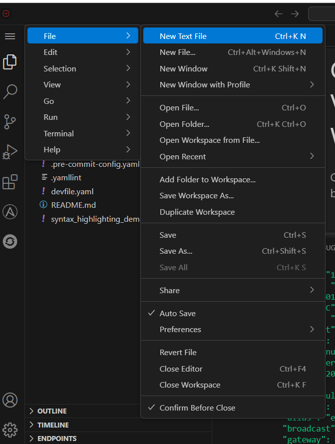

1. **브랜치 탭 열기**
   - GitHub Desktop에서 **"Branches"** 탭을 클릭합니다

2. **브랜치 목록 확인**
   - "Branches" 드롭다운 메뉴에서 브랜치 목록을 확인할 수 있습니다
   - 현재 브랜치가 체크 표시와 함께 표시됩니다
   - 원격 브랜치(`origin/` 접두사)도 확인할 수 있습니다

3. **브랜치 전환**
   - 브랜치 목록에서 다른 브랜치를 선택하여 전환할 수 있습니다

#### 단계 4: 원격 저장소와 동기화

1. **변경사항 푸시**
   - 커밋한 변경사항을 원격 저장소에 푸시합니다
   - 소스 제어 패널에서 **"..."** 메뉴를 클릭하고 **"Push"**를 선택합니다
   - 또는 터미널에서:

   ```bash
   git push origin sandbox-activity
   ```

2. **원격 변경사항 가져오기**
   - 원격 저장소의 최신 변경사항을 가져옵니다
   - 소스 제어 패널에서 **"..."** 메뉴를 클릭하고 **"Pull"**을 선택합니다
   - 또는 터미널에서:

   ```bash
   git pull origin sandbox-activity
   ```

---

### 7.3 Pull Request 생성

변경사항을 원본 저장소에 반영하기 위해 Pull Request(PR)를 생성할 수 있습니다.

#### 단계 1: GitHub에서 저장소 확인

1. **GitHub 저장소 접속**
   - 브라우저에서 포크된 GitHub 저장소로 이동합니다
   - 예: `https://github.com/your-username/ansible-devspaces-demo`

   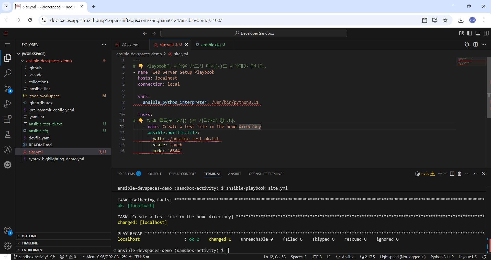

2. **브랜치 확인**
   - 현재 브랜치가 원본 저장소보다 앞서 있는지 확인합니다
   - 예: `sandbox-activity` 브랜치가 원본보다 1 커밋 앞서 있음

#### 단계 2: Pull Request 생성 준비

1. **"Compare & pull request" 버튼 확인**
   - GitHub 저장소 페이지에서 **"Compare & pull request"** 버튼이 표시될 수 있습니다
   - 이 버튼은 브랜치가 원본보다 앞서 있을 때 나타납니다

2. **변경사항 리뷰**
   - 변경된 파일 목록을 확인합니다
   - 최근 커밋 메시지를 확인합니다
   - 예: "feat: Fix Python interpreter issue and add basic file creation test playbook"

#### 단계 3: Pull Request 생성

1. **"Create Pull Request" 버튼 클릭**
   - GitHub 저장소 페이지에서 **"Contribute"** 드롭다운 메뉴를 클릭합니다
   - 또는 **"Compare & pull request"** 버튼을 클릭합니다

2. **PR 정보 입력**
   - 제목: 변경사항을 설명하는 제목
   - 본문: 변경사항에 대한 상세 설명

3. **PR 생성**
   - **"Create Pull Request"** 버튼을 클릭합니다

#### 단계 4: PR 리뷰 및 병합

1. **PR 리뷰 대기**
   - PR이 생성되면 원본 저장소 관리자가 리뷰합니다
   - 리뷰 코멘트가 있을 수 있습니다

2. **변경사항 수정 (필요한 경우)**
   - 리뷰 코멘트에 따라 변경사항을 수정합니다
   - 추가 커밋을 푸시하면 PR에 자동으로 반영됩니다

3. **PR 병합**
   - 리뷰가 완료되면 관리자가 PR을 병합합니다
   - 병합 후 원본 저장소에 변경사항이 반영됩니다

---

### 다음 단계

Git 작업 및 버전 관리 방법을 배웠습니다. 이제 추가 학습 자료를 확인하고 다음 단계를 계획해보겠습니다.

---

## 추가 학습 자료

이 가이드를 완료했다면, 다음 단계로 Ansible과 OpenShift Dev Spaces에 대해 더 깊이 학습할 수 있습니다.

### 8.1 Ansible 학습 자료

#### 공식 문서

- **Ansible 공식 문서**: [https://docs.ansible.com/](https://docs.ansible.com/)
  - 플레이북 작성 가이드
  - 모듈 레퍼런스
  - 모범 사례

- **Ansible 모듈 레퍼런스**: [https://docs.ansible.com/ansible/latest/modules/modules_by_category.html](https://docs.ansible.com/ansible/latest/modules/modules_by_category.html)
  - 모든 Ansible 모듈 목록
  - 모듈별 사용법 및 예제

#### Ansible 핵심 개념

- **플레이북**: 시스템에 적용할 작업을 정의하는 파일
- **역할(Role)**: 재사용 가능한 작업 모음
- **모듈**: 특정 작업을 수행하는 코드 단위
- **Facts**: 대상 시스템의 정보
- **인벤토리**: 관리 대상 호스트 목록
- **변수**: 플레이북에서 사용하는 값
- **템플릿**: Jinja2 템플릿을 사용한 동적 파일 생성

#### 추천 학습 경로

1. **기본 플레이북 작성**
   - 파일 및 디렉토리 관리
   - 패키지 설치
   - 서비스 관리

2. **변수 및 템플릿 사용**
   - 변수 정의 및 사용
   - Jinja2 템플릿 문법

3. **역할(Role) 작성**
   - 역할 구조 이해
   - 역할 재사용

4. **인벤토리 관리**
   - 정적 인벤토리
   - 동적 인벤토리

5. **고급 기능**
   - 조건부 실행
   - 반복문
   - 핸들러
   - 오류 처리

---

### 8.2 OpenShift Dev Spaces 학습 자료

#### 공식 문서

- **OpenShift Dev Spaces 문서**: [https://access.redhat.com/documentation/en-us/red_hat_openshift_dev_spaces/](https://access.redhat.com/documentation/en-us/red_hat_openshift_dev_spaces/)
  - 관리자 가이드
  - 사용자 가이드
  - Devfile 레퍼런스

- **Devfile 스펙**: [https://devfile.io/](https://devfile.io/)
  - Devfile 스키마 문서
  - 예제 및 사용법

#### Dev Spaces 주요 기능

- **클라우드 개발 환경**: 브라우저에서 완전한 IDE 환경 제공
- **코드로 정의된 환경**: `devfile.yaml`로 환경 관리
- **VS Code 호환**: VS Code 확장 프로그램 사용 가능
- **컨테이너 기반**: Docker 컨테이너로 격리된 환경 제공

#### 추천 학습 경로

1. **Devfile 작성**
   - 기본 Devfile 구조
   - 컴포넌트 정의
   - 명령어 정의

2. **워크스페이스 관리**
   - 워크스페이스 생성 및 삭제
   - 리소스 관리
   - 스토리지 관리

3. **확장 프로그램 사용**
   - VS Code 확장 프로그램 설치
   - 팀 공유 설정

---

### 8.3 다음 단계 추천

이 가이드를 완료한 후 다음을 시도해보세요:

1. **더 복잡한 플레이북 작성**
   - 여러 작업을 포함하는 플레이북
   - 조건부 실행 및 반복문 사용
   - 변수 및 템플릿 활용

2. **Ansible 역할 작성**
   - 재사용 가능한 역할 생성
   - 역할 테스트 및 문서화

3. **Molecule 테스트**
   - 프로젝트의 `collections/` 디렉토리에서 Molecule 테스트 실행
   - 테스트 주도 개발(TDD) 실습

4. **Devfile 커스터마이징**
   - 자신만의 Devfile 작성
   - 필요한 도구 및 환경 변수 추가

5. **Git 워크플로우 개선**
   - Git Flow 전략 적용
   - CI/CD 파이프라인 통합

---

### 8.4 유용한 리소스

#### 커뮤니티

- **Ansible 공식 포럼**: [https://forum.ansible.com/](https://forum.ansible.com/)
- **Red Hat Developer 커뮤니티**: [https://developers.redhat.com/](https://developers.redhat.com/)

#### 도구

- **Ansible Lint**: Ansible 코드 품질 검사 도구
- **Molecule**: Ansible 역할 테스트 프레임워크
- **Ansible Navigator**: Ansible 명령어 실행을 위한 TUI 도구

---

### 결론

이 가이드를 통해 다음을 학습했습니다:

- Red Hat OpenShift Dev Spaces 환경 설정
- Ansible 플레이북 작성 및 실행
- Python 인터프리터 설정 및 문제 해결
- Git을 사용한 버전 관리
- 시스템 정보 수집 및 활용

이제 Ansible과 OpenShift Dev Spaces를 사용하여 자동화 작업을 시작할 준비가 되었습니다!

**행운을 빕니다!** 🚀

---

## 부록: 자주 묻는 질문 (FAQ)

### Q1: 플레이북 실행이 실패합니다. 어떻게 해야 하나요?

**A:** 다음을 확인하세요:
1. Python 인터프리터 경로가 올바른지 확인 (`python3 --version`, `which python3`)
2. 플레이북의 YAML 문법이 올바른지 확인 (들여쓰기, 대시 등)
3. `-vvv` 옵션으로 상세 출력 확인
4. PROBLEMS 패널에서 오류 메시지 확인

### Q2: 경고 메시지가 많이 나타납니다. 문제가 있나요?

**A:** 일부 경고는 무시해도 됩니다:
- 인벤토리 경고: 로컬 호스트 사용 시 무시 가능
- 세계 쓰기 가능 디렉토리 경고: WSL 환경에서는 일반적으로 무시 가능

하지만 오류(`FAILED`)는 반드시 해결해야 합니다.

### Q3: Dev Spaces에서 로컬 파일 시스템에 접근할 수 있나요?

**A:** Dev Spaces는 클라우드 환경에서 실행되므로, 로컬 파일 시스템에 직접 접근할 수 없습니다. 모든 파일은 워크스페이스 내에서 관리되며, Git을 통해 동기화됩니다.

### Q4: 여러 플레이북을 동시에 실행할 수 있나요?

**A:** 네, 가능합니다. 하지만 같은 리소스에 접근하는 경우 충돌이 발생할 수 있으므로 주의해야 합니다.

### Q5: 플레이북을 예약 실행할 수 있나요?

**A:** Dev Spaces IDE 자체에서는 예약 실행 기능이 없습니다. 하지만 Ansible Tower/AWX 또는 CI/CD 파이프라인을 통해 예약 실행할 수 있습니다.

---

**문서 버전**: 1.0  
**최종 업데이트**: 2025년 11월

